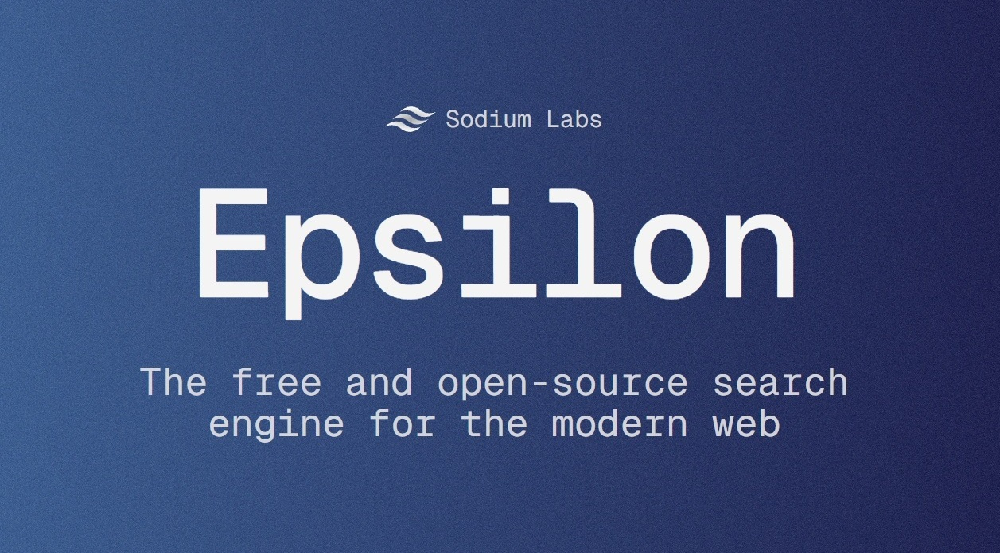

<div align="center">
<br />
    <h1>Epsilon</h1>
    <p>
        <a href="https://discord.gg/8PDXWSHH7k"></a>
        <a href="https://github.com/sodium-labs/epsilon/commits/main"></a>
    </p>
</div>



# About

Epsilon is a full-featured web crawler and indexer with a PostgreSQL database and a documented API to interact with the data.
It was made for the [Epsilon Search Engine](https://epsilon.sodiumlabs.xyz).

---

Epsilon is organized as a monorepo with the following workspaces:

- `workspaces/api` - Public API to search the database and access analytics
- `workspaces/cli` - Main CLI to launch and manage services
- `workspaces/crawler` - Website crawler
- `workspaces/database` - SQL models and database functions
- `workspaces/favicons` - Favicon downloader
- `workspaces/indexer` - Page indexer
- `workspaces/monitor` - System/database monitoring and analytics
- `workspaces/utils` - Shared utility functions

📚 The API documentation is available at `http://localhost:<port>/docs`

---

> [!WARNING]
> Epsilon is currently in development.
> All workspaces still require extensive testing. Known issues include:
> - `favicons`: Does not download all favicons consistently
> - `indexer`: Already fast, but needs multi-threading for improved performance
> - `crawler`: Multi-threading can lead to random deadlocks that either freeze tasks silently, crash the entire app, or produce a lot of errors. Restarting Epsilon usually resolves this, but it must be fixed to allow reliable background operation.

# Usage

> [!NOTE]
> Refer to `.env.example` for environment variable documentation.

## Development

- `cargo run` -> Start all services
- `cargo run -- api indexer` -> Start only the API and the indexer
- `cargo run -- - api` -> Start all services except the API

Available services: `api`, `crawler`, `favicons`, `indexer`, `monitor`

## Running tests:

Run all tests with:
```sh
cargo test
```

## Recommended usage in production

- `cargo build --release` -> Build the app
- `cargo run --release -- api` -> Launch the API and submit URLs via `POST /api/request-url`
- `cargo run --release -- monitor crawler` -> Start crawling the web
- `cargo run --release -- monitor indexer favicons` -> Index pages and download favicons
- `cargo run --release -- monitor api` -> Run the search engine

## PostgreSQL

Epsilon uses [Diesel](https://diesel.rs) for database management.

- `diesel database reset` -> Drop and recreate the database
- `diesel migration run` -> Run all migrations
- `diesel migration redo` -> Redo the last migration

# 🐧 Linux setup

You will need `libpq-dev` (PostgreSQL) and Rust (via `rustup`):

```sh
sudo apt update
sudo apt install libpq-dev
curl https://sh.rustup.rs -sSf | sh
```

# TODO:
- Log all requests to a file

# Support

If you like the project, please help us at https://patreon.com/sodiumlabs.
You can also join our Discord at https://discord.gg/8PDXWSHH7k.
